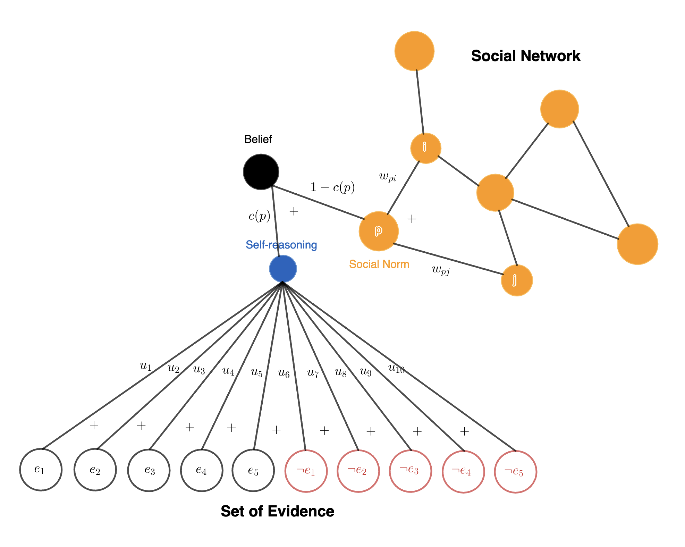

## Overview



This repository contains the code used to implement a new model of belief propagation that tries to explain the underlying stuborness of individual as well as possible back fire effect by treating each individual as a single layer neural network on a set of evidence for a particular statement with input being confidence level on each evidence, and belief of the statment is the output of this neural network. People influence eachother through stating their beliefs directly but also through propagating confidence level on a set of evidence. The weights of the neural network is interpreted as the structure of understanding an individual has on a particular statement.

## Prerequisites

The following Python3 libraries are used in this library. All of the below can be installed using `pip` or `conda`.

* [Numpy](https://numpy.org/install/)
  
* [NetworkX](https://networkx.org/documentation/stable/install.html)

* [Mesa]([https://scipy.org/install/](https://github.com/projectmesa/mesa))

* [Matplotlib](https://matplotlib.org/stable/users/installing/index.html)

* [Tqdm](https://pypi.org/project/tqdm/) (optional)

## Installation

```
import mesa 
import numpy as np 
import networkx as nx 
import seaborn as sns 
import matplotlib.pyplot as plt 
import os 
```

## Contact

For more details, please contact Yujian Fu at yujianfu@umich.edu.
